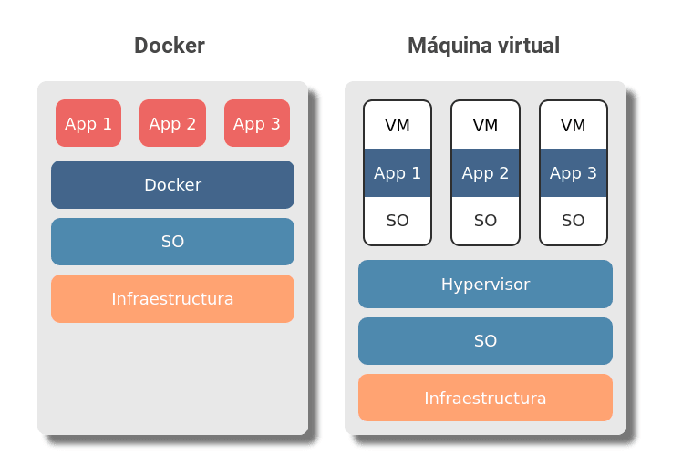

# Què és Docker i com funciona?

## Una explicació senzilla
Si tens una aplicació o servei i vols que funcioni en diferents sistemes com ara VPS (**Virtual Private Server** en anglès) o màquines, sense cap problema, considera la possibilitat d'utilitzar contenidors. Una de les plataformes de contenidors més populars és **Docker**, encara que no tothom sap què és i com funciona.

## Què és Docker?

**Docker** és un programari de codi obert utilitzat per desplegar aplicacions dins de contenidors virtuals. La ***contenerització*** permet que diverses aplicacions funcionin en diferents entorns complexos. Per exemple, **Docker** permet executar el sistema de gestió de continguts **WordPress** en **sistemes Windows**, **Linux** i **macOS** sense cap problema.

## Docker vs la màquina virtual

Encara que **Docker** i les **màquines virtuals** tenen un propòsit similar, el rendiment, la compatibilitat amb el **sistema operatiu** (**SO**) i la portabilitat difereixen significativament.

La diferència principal és que els contenidors **Docker** comparteixen el **sistema operatiu** de l'amfitrió, mentre que les màquines virtuals també tenen un **sistema operatiu** convidat que s'executa sobre el sistema amfitrió.

Aquest mètode de funcionament afecta el rendiment, les necessitats de maquinari i la compatibilitat amb el **sistema operatiu**.



Consulta la taula següent per veure una comparació en profunditat.
	
||**Docker**|**Màquina Virtual**|
|---|---|---|
|**SO**|**SO** compartit entre contenidors|Nou **SO** per a cada VM|
|**Seguretat**|Menys segur perquè el **SO** i<br>el **kernel** són compartits|Més segur perquè les màquines virtuals<br>no comparteixen el **sistema operatiu**|
|**Rendiment**|Rendiment ràpid fins i tot<br>amb diversos contenidors|Més màquines virtuals equivalen<br>a un rendiment menys estable|
|**Temps d'arrencada**|Ràpid (segons)|Lent (minuts)|
|**Necessitats de memòria**|Lleugera|Requereix molta memòria|
|**Necessitats d'emmagatzematge**|Normalment megabytes|Normalment gigabytes|
|**Portabilitat**|Fàcil de desplegar<br>en diferents entorns|Difícil de portar una<br>màquina virtual a un altre sistema|

Tot i que la tecnologia de contenidors de **Docker** està per sobre en la majoria dels aspectes, les **màquines virtuals** són més segures perquè la seguretat del **SO** es manté independent del maquinari.

## Entendre els contenidors Docker

Lús de contenidors **Docker** estalvia als usuaris la molèstia de resoldre possibles problemes de compatibilitat entre sistemes.
Això és degut a que amb **Docker**, una peça de programari s'executa igual en tots els entorns.

### Què és un contenidor Docker?

Un **contenidor Docker** és un **paquet de programari amb totes les dependències necessàries per executar una aplicació específica**.

Tota la configuració i les instruccions per iniciar o aturar els contenidors són dictades per la imatge de Docker.

Cada cop que un usuari executa una imatge, es crea un nou contenidor.

És fàcil gestionar els contenidors amb l'ajuda de l'**API de Docker** o la interfície de **línia d'ordres** (CLI).

Si necessiteu diversos contenidors, els usuaris poden controlar-los amb l'eina **```Docker compose```**.

## Com funciona Docker?

L'**arquitectura de Docker** consta de **quatre components principals**, a més a més dels contenidors **Docker** que ja hem cobert.

* **Client Docker**: és el component principal per crear, gestionar i executar aplicacions en contenidors. El **client Docker** és el mètode principal per controlar el **servidor Docker** mitjançant una **```CLI```** com ***Command Prompt*** (**Windows**) o ***Terminal*** (**macOS**, **Linux**).

* **Servidor Docker**: també conegut com a **dimoni Docker**. Espera les peticions de l'**API REST** fetes pel **client Docker** i gestiona les imatges i els contenidors.

* **Imatges Docker**: indiquen al **servidor Docker** els requisits per crear un **contenidor Docker**. Les imatges es poden descarregar de llocs web com **Docker Hub**. També és possible crear una **imatge personalitzada**: per això, els usuaris han de crear un **fitxer Docker** i passar-lo al servidor. Cal tenir en compte que **Docker** no esborra les imatges que no s'utilitzen, per la qual cosa els usuaris han d'eliminar ells mateixos les dades de la imatge abans que n'hi hagi massa.

* **Registre Docker**: és una aplicació de codi obert del costat del servidor que s'utilitza per allotjar i distribuir imatges de Docker. El registre és molt útil per emmagatzemar imatges localment i mantenir un control complet sobre elles. Com a alternativa, els usuaris poden accedir al ja esmentat **Docker Hub**, el repositori més gran d'imatges Docker del món.

## Avantatges i desavantatges de Docker

Tot i que **Docker** té molts avantatges, es queda curt en alguns aspectes. En aquesta secció, revisarem els principals pros i contres del programari.

### Avantatges de Docker

* **Portabilitat**: el principal atractiu de **Docker** és la portabilitat. Permet als usuaris fer o instal·lar una aplicació complexa en una màquina i estar segurs que hi funcionarà. Els **contenidors Docker** inclouen tot el que necessita una aplicació gairebé sense intervenció de l'usuari.

* **Automatització**: amb l'ajuda de les tasques cron i els **contenidors Docker**, els usuaris poden automatitzar el seu treball fàcilment. L'automatització ajuda els desenvolupadors a evitar tasques tedioses i repetitives, així com a estalviar temps.

* **Comunitat**: **Docker** té un **canal de Slack** dedicat, un fòrum de la comunitat i milers de col·laboradors en llocs web per a desenvolupadors com **StackOverflow**. A més, hi ha més de **9 milions d'imatges de contenidors** allotjades a **Docker Hub**.

### Inconvenients de Docker

* **Velocitat**: encara que executar una aplicació a través d'un **contenidor Docker** és més ràpid que fer-ho en una màquina virtual, segueix sent considerablement més lent que executar aplicacions de forma nativa en un servidor físic.

* **Facilitat d'ús**: El **Docker** no està pensat per executar aplicacions que requereixin una **interfície gràfica d'usuari** (**```GUI```**). Això vol dir que els usuaris han d'estar familiaritzats amb la línia d'ordres i realitzar totes les accions allà. La pronunciada corba d'aprenentatge, els advertiments específics del sistema operatiu i les freqüents actualitzacions fan que dominar **Docker** sigui tot un repte. Fins i tot si creus que coneixes **Docker** a la perfecció, encara cal tenir en compte l'orquestració, cosa que afegeix un altre nivell de complexitat.

* **Seguretat**: **Docker** s'executa al sistema operatiu del host. Això vol dir que qualsevol programari maliciós ocult als contenidors pot arribar a la màquina amfitriona.


[Següent **Arquitectura Docker**](./teo-docker-02-arquitectura.md)