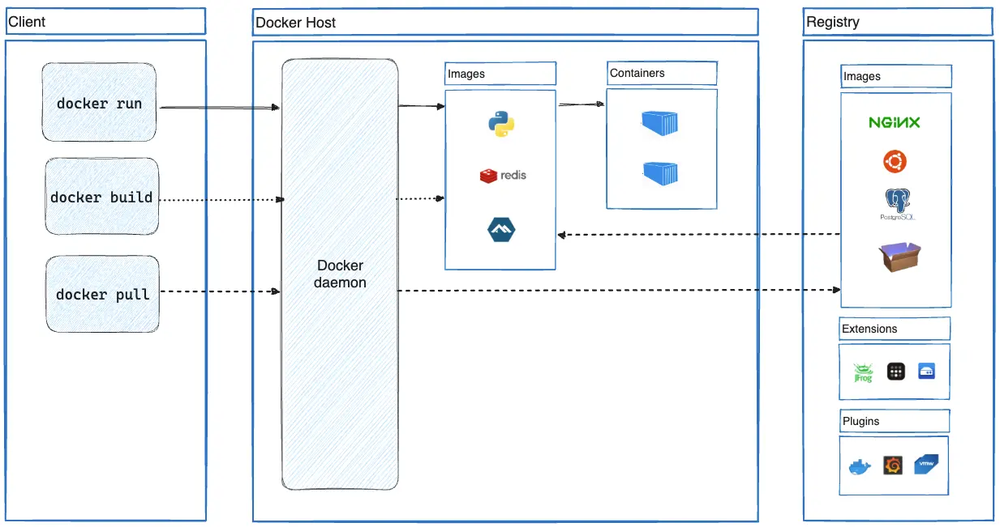

# Arquitectura de Docker

**Docker** utilitza una arquitectura **```client-servidor```**.

El **client de Docker** es comunica amb el **dimoni Docker**, que s'encarrega de la construcció, l'execució i la distribució dels contenidors **Docker**.

El ***client de* Docker** i el ***dimoni de* Docker** es poden executar al mateix sistema o podeu connectar un *client de **Docker*** a un ***dimoni de* Docker** remot. El ***client de* Docker** i el ***dimoni de* Docker** es comuniquen mitjançant una **```API REST```**, mitjançant **```sòcols UNIX```** o una **interfície de xarxa**. Un altre ***client de* Docker** és **```Docker Compose```**, que us permet treballar amb aplicacions que consisteixen en un **conjunt de contenidors**.



## El dimoni Docker (**```docker daemon```** - **```dockerd```**)

El **dimoni Docker** escolta les sol·licituds de l'**API de Docker** i gestiona objectes de **Docker** com ara ***imatges***, ***contenidors***, ***xarxes*** i ***volums***. Un dimoni també es pot comunicar amb altres dimonis per gestionar els **serveis de Docker**.

## El client Docker

El **client de Docker** (**```docker```**) és la forma principal en què molts usuaris de **Docker** interactuen amb **Docker**. Quan utilitzeu ordres com ara **```docker run```**, el client envia aquestes ordres a **```dockerd```**, que les executa. L'ordre **docker** utilitza l'**API de Docker**. El **client de Docker** es pot comunicar amb més d'un dimoni.

## Docker Desktop

**Docker Desktop** és una aplicació fàcil d'instal·lar per al vostre entorn **Mac**, **Windows** o **Linux** que us permet crear i compartir aplicacions i ***microserveis en contenidors***. **Docker Desktop** inclou el **dimoni Docker** (**```dockerd```**), el **client Docker** (**docker**), **Docker Compose**, **Docker Content Trust**, **Kubernetes** i **Credential Helper**. Per obtenir més informació, vegeu **Docker Desktop** .

## Registres Docker

Un **registre de Docker** emmagatzema **imatges de Docker**. **Docker Hub** és un registre públic que qualsevol pot utilitzar i **Docker** cerca imatges a **Docker Hub** de manera predeterminada. Fins i tot podeu executar el vostre propi registre privat.

Quan utilitzeu les ordres **```docker pull```** o **```docker run```**, **Docker** extreu les imatges necessàries del registre configurat. Quan utilitzeu l'ordre **```docker push```**, **Docker** envia la vostra imatge al registre configurat.

## Objectes Docker

Quan utilitzeu **Docker**, esteu creant i utilitzant **imatges**, **contenidors**, **xarxes**, **volums**, **connectors** i **altres objectes**. 

Aquesta secció és una breu visió general d'alguns d'aquests objectes.

### Imatges

Una **imatge** és una **plantilla de només lectura amb instruccions per crear un *contenidor Docker***. Sovint, una imatge es basa en una altra imatge, amb alguna personalització addicional. Per exemple, podeu crear una imatge que es basa en la imatge **```ubuntu```**, però instal·la el **servidor web ```apache```** i la vostra aplicació, així com els detalls de configuració necessaris perquè la vostra aplicació s'executi.

Podeu crear les vostres pròpies imatges o només podeu utilitzar les creades per altres i publicades en un registre. Per crear la vostra pròpia imatge, creeu un **```Dockerfile```** amb una sintaxi senzilla per definir els passos necessaris per crear la imatge i executar-la. Cada instrucció d'un **```Dockerfile```** crea una **capa a la imatge**. Quan canvieu el **```Dockerfile```** i reconstruïu la imatge, només es reconstrueixen les capes que han canviat. Això és part del que fa que les imatges siguin tan lleugeres, petites i ràpides, en comparació amb altres tecnologies de virtualització.

### Contenidors

Un **contenidor** és una **instància executable d'una imatge**. Podeu crear, iniciar, aturar, moure o suprimir un contenidor mitjançant l'**API de Docker** o la **CLI de Docker**. Podeu connectar un contenidor a una o més xarxes, adjuntar-hi emmagatzematge o fins i tot crear una imatge nova en funció del seu estat actual.

Per defecte, un contenidor està relativament ben aïllat d'altres contenidors i de la seva màquina host. Podeu controlar l'aïllament de la xarxa, l'emmagatzematge o altres subsistemes subjacents d'un contenidor d'altres contenidors o de la màquina host.

**Un contenidor es defineix per la seva imatge**, així com per qualsevol opció de configuració que li proporcioneu quan el creeu o el inicieu. Quan s'elimina un contenidor, desapareixen els canvis en el seu estat que no s'emmagatzemen a l'emmagatzematge persistent.

[Següent **Ordres basiques**](./teo-docker-03-ordres-basiques.md)