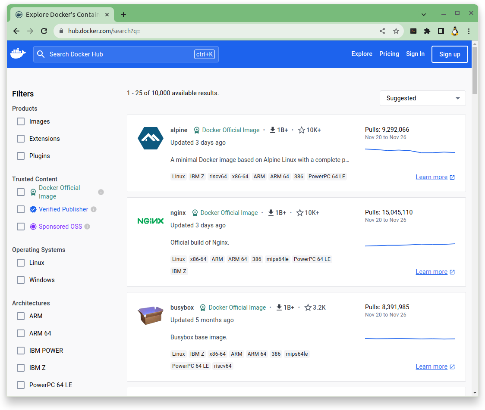

# Ordres bàsiques de Docker

### [**1.** Ajuda per qualsevol comanda de **```docker```**](#ajuda-per-qualsevol-comanda-de-docker)

### [**2.** Executar un contenidor](#executar-un-contenidor)

### [**3.** Buscar una imatge](#buscar-una-imatge)

### [**4.** Descarregar una imatge](#descarregar-una-imatge)

### [**5.** Veure les imatges](#veure-les-imatges)

### [**6.** Inspeccionar una imatge](#inspeccionar-una-imatge)

### [**7.** Historial d'una imatge](#historial-duna-imatge)

### [**8.** Esborrar una imatge](#esborrar-una-imatge)

<hr>

## Ajuda per qualsevol comanda de **```docker```**

Qualsevol **comanda de ```docker```** té el parametre **```--help```**, el qual ens ofereix informació d'ajuda d'aquell objecte o d'aquella comanda en concret.

Totes les **comandes de ```docker```** segueixen el mateix patró:

**```docker <objecte> [opcions] comanda```**

**```docker```** per indicar que executem una comanda de **```docker```**

**```<objecte>```** per indicar sobre quin objecte de **```docker```** executarem la comanda de **```docker```**.
  
  Els **```objectes```** que ferem servir nosaltres son:

 * **```image```**: per executar comandes relacionades amb les ***imatges*** de **```docker```**.

    Per més informació podeu consultar [**Totes les opcions ```docker image```**](./teo-docker-00-ajuda-de-les-comandes-docker.md#tota-lajuda-de-docker-image---help)

 * **```container```**: per executar comandes relacionades amb els ***contenidors*** de **```docker```**.
 
    Per més informació podeu consultar [**Totes les opcions ```docker container```**](./teo-docker-00-ajuda-de-les-comandes-docker.md#totes-les-opcions-de-docker-container)
 
 * **```volume```**: per executar comandes relacionades amb els ***volums*** de **```docker```**.
 
    Per més informació podeu consultar [**Totes les opcions ```docker volume```**](./teo-docker-00-ajuda-de-les-comandes-docker.md#totes-les-opcions-de-docker-volume)

 * **```network```**: per executar comandes relacionades amb les ***xarxes*** entre ***contenidors*** de **```docker```**.
 
    Per més informació podeu consultar [**Totes les opcions ```docker network```**](./teo-docker-00-ajuda-de-les-comandes-docker.md#totes-les-opcions-de-docker-network)

**```opcions```**  per indicar diferents opcions que volem aplicar sobre l'objecte de **```docker```**.
 
    Aquesta part és opcional, és a dir, que **NO ÉS OBLIGATÒRIA**.

**```comanda```** per indicar les comandes que executarem a l'objecte de **```docker```** sobre el que executem la comanda de **```docker```**.
 
  Hi ha **```comandes```** que son **globals**, és a dir, que es poden fer servir per qualsevol **```objectes```** de **```docker```**. Com son:

 * **```list```**: per llistar els objectes que tenim localment.

### Per exemple:

  * **```sudo docker image list```** llista totes les imatges que hi ha en el nostre servidor.

```
profe@docker-sxm:~$ sudo docker image list
REPOSITORY     TAG       IMAGE ID       CREATED        SIZE
ubuntu         latest    b6548eacb063   6 days ago     77.8MB
alpine         latest    b541f2080109   6 days ago     7.34MB
imatge-joan    latest    72817cfce2d3   6 days ago     7.34MB
ubuntu/nginx   latest    ecd70a659510   8 days ago     140MB
wordpress      latest    bc823df9ead2   2 weeks ago    668MB
nginx          latest    a6bd71f48f68   2 weeks ago    187MB
mysql          5.7       bdba757bc933   6 weeks ago    501MB
hello-world    latest    9c7a54a9a43c   7 months ago   13.3kB
profe@docker-sxm:~$
```

  * **```sudo docker container list```** llista tots els contenidors que hi ha en el nostre servidor.

```
profe@docker-sxm:~$ sudo docker container list
CONTAINER ID   IMAGE       COMMAND                  CREATED        STATUS        PORTS                                   NAMES
2a7adf030085   wordpress   "docker-entrypoint.s…"   16 hours ago   Up 16 hours   0.0.0.0:8085->80/tcp, :::8085->80/tcp   c02-wp-wordpress-1
60ab6de92f81   mysql:5.7   "docker-entrypoint.s…"   16 hours ago   Up 16 hours   3306/tcp, 33060/tcp                     c02-wp-db-1
3b95857b4063   nginx       "/docker-entrypoint.…"   3 days ago     Up 3 days     0.0.0.0:8080->80/tcp, :::8080->80/tcp   c01-nginx
profe@docker-sxm:~$ 
```

 * **```remove```**: per esborrar un o més dels objectes que tenim localment.

 * **```prune```**: per netejar els objectes, ja sigui per que estan inactius o aturats, localment.


<hr>

## Executar un contenidor

Per **executar un contenidor** farem servir l'ordre **```run```** i el **nom de la imatge** de la qual derivarà. Es pot especificar com es vol que s'anomeni el teu contenidor amb l'opció **```--name```**.

* **Comanda a executar**:

```
sudo docker run hello-world
```

* **Sortida**:

```
profe@docker-sxm:~$ sudo docker run hello-world

Hello from Docker!
This message shows that your installation appears to be working correctly.

To generate this message, Docker took the following steps:
 1. The Docker client contacted the Docker daemon.
 2. The Docker daemon pulled the "hello-world" image from the Docker Hub.
    (amd64)
 3. The Docker daemon created a new container from that image which runs the
    executable that produces the output you are currently reading.
 4. The Docker daemon streamed that output to the Docker client, which sent it
    to your terminal.

To try something more ambitious, you can run an Ubuntu container with:
 $ docker run -it ubuntu bash

Share images, automate workflows, and more with a free Docker ID:
 https://hub.docker.com/

For more examples and ideas, visit:
 https://docs.docker.com/get-started/

profe@docker-sxm:~$ _
```

Després d'executar l'ordre anterior, **Docker** mirarà si la imatge de **```hello-world```** està descarregada localment, i si no és així la descarregarà. I a continuació crearà un contenidor, aquest contenidor s'executarà, realitzarà la seva funció i s'acabarà d'executar.

### Per més informació podeu consultar [**```docker run --help```**](../files/teo-docker-00-ajuda-de-les-comandes-docker.md#tota-lajuda-de-docker-run---help)


<hr>

## Buscar una imatge

La imatge de **```hello-world```** és probablement la més avorrida que hi ha i de ben segur voldràs buscar una imatge que faci alguna cosa més que imprimir text a la pantalla.

Per cercar una imatge podem fer servir l'ordre **```docker search```**. El que fa aquesta ordre és connectar-se a **```docker hub```** i buscar la imatge que li indiquem.

A **```Dockerhub```** hi ha imatges de **```mysql```**, de **```nginx```**, d'**```alpine linux```**, de **```python```**, de **```django```**, **```wordpress```**, **```ghost```** i gairebé qualsevol altra tecnologia que puguis anomenar.

Si volem buscar totes les imatges que hi ha d'**```nginx```**  a **```docker hub```**, ho farem de la següent manera.

* **Comanda a executar**:

```
sudo docker search nginx
```

* **Sortida**:

```
profe@docker-sxm:~$ sudo docker search nginx
NAME                               DESCRIPTION                                     STARS     OFFICIAL   AUTOMATED
nginx                              Official build of Nginx.                        19311     [OK]       
unit                               Official build of NGINX Unit: Universal Web …   19        [OK]       
nginxinc/nginx-unprivileged        Unprivileged NGINX Dockerfiles                  136                  
nginx/nginx-ingress                NGINX and  NGINX Plus Ingress Controllers fo…   86                   
nginx/nginx-prometheus-exporter    NGINX Prometheus Exporter for NGINX and NGIN…   33                   
nginxinc/nginx-s3-gateway          Authenticating and caching gateway based on …   3                    
nginx/unit                         This repository is retired, use the Docker o…   64                   
nginx/nginx-ingress-operator       NGINX Ingress Operator for NGINX and NGINX P…   2                    
nginxinc/amplify-agent             NGINX Amplify Agent docker repository           1                    
nginx/nginx-quic-qns               NGINX QUIC interop                              1                    
nginxinc/ingress-demo              Ingress Demo                                    4                    
nginxproxy/nginx-proxy             Automated Nginx reverse proxy for docker con…   119                  
nginxproxy/acme-companion          Automated ACME SSL certificate generation fo…   127                  
bitnami/nginx                      Bitnami nginx Docker Image                      180                  [OK]
bitnami/nginx-ingress-controller   Bitnami Docker Image for NGINX Ingress Contr…   32                   [OK]
ubuntu/nginx                       Nginx, a high-performance reverse proxy & we…   103                  
nginxinc/nginmesh_proxy_debug                                                      0                    
nginxproxy/docker-gen              Generate files from docker container meta-da…   14                   
kasmweb/nginx                      An Nginx image based off nginx:alpine and in…   6                    
nginxinc/mra-fakes3                                                                0                    
rancher/nginx-ingress-controller                                                   11                   
nginxinc/ngx-rust-tool                                                             0                    
nginxinc/mra_python_base                                                           0                    
nginxinc/nginmesh_proxy_init                                                       0                    
profe@docker-sxm:~$ _
```

D'altra banda, si preferiu fer-ho d'una manera més visual podeu visitar [Explore Docker's Container Image Repository | Docker Hub](https://hub.docker.com/search?q=). Aquí es pot aconseguir qualsevol tipus d'imatge que t'imaginis, fins i tot pujar les teves. Dóna't una volta i mira totes les opcions que estan disponibles per descarregar. Per ara no en descarregarem cap altra.



### Per més informació podeu consultar [ **```docker search --help```**](../files/teo-docker-00-ajuda-de-les-comandes-docker.md#tota-lajuda-de-docker-search---help)

<hr>

## Descarregar una imatge

Si només es vol descarregar una imatge perquè estigui disponible, sense executar-la es pot fer servir l'ordre **```docker pull```**, seguit del **nom de la imatge**.

Per exemple, anteriorment, hem trobat, buscant les imatges que hi ha d'**```nginx```**  a **```docker hub```**, una imatge per **```ubuntu/nginx```**.

> 
> * **Comanda a executar**:
> 
> ```
> sudo docker search nginx
> ```
> 
> * **Sortida**:
> 
> ```
> profe@docker-sxm:~$ sudo docker search ubuntu/nginx --no-trunc
> NAME           DESCRIPTION                                                                                       STARS     OFFICIAL   AUTOMATED
> ubuntu/nginx   Nginx, a high-performance reverse proxy & web server. Long-term tracks maintained by Canonical.   103                  
> profe@docker-sxm:~$ _
> ```
> 
> Trobem la següent informació: "**```nginx```, un servidor intermediari invers i d'alt rendiment. Manteniment del sistema a llarg termini, ofert per Canonical.**

### Per més informació podeu consultar [ **```docker pull```**](../files/teo-docker-00-opcions-de-les-comandes-docker.md#comanda-2-docker-image-pull)

Per tant, si volem descarregar aquesta imatge **```ubuntu/nginx```** cal fer-ho de la següent manera:

* **Comanda a executar**:

```
sudo docker pull ubuntu/nginx
```

* **Sortida**:

```
profe@docker-sxm:~$ sudo docker pull ubuntu/nginx
Using default tag: latest
latest: Pulling from ubuntu/nginx
7f5c551db8d8: Pull complete 
a0d15e118342: Pull complete 
dc4f35fd17ef: Pull complete 
6788dc39928d: Pull complete 
Digest: sha256:363f7087a9ec55fddb087606b0f7a28514cf1bf70462913123e1f7f72a6f11f7
Status: Downloaded newer image for ubuntu/nginx:latest
docker.io/ubuntu/nginx:latest
profe@docker-sxm:~$ _
```

### Per més informació podeu consultar [ **```docker search --help```**](../files/teo-docker-00-ajuda-de-les-comandes-docker.md#tota-lajuda-de-docker-search---help)

<hr>

## Veure les imatges

Si ara executem **```docker images```** apareixerà la nostra imatge descarregada.

* **Comanda a executar**:

```
sudo docker image list
```

* **Sortida**:


```
profe@docker-sxm:~$ sudo docker image list
REPOSITORY     TAG       IMAGE ID       CREATED        SIZE
ubuntu         latest    b6548eacb063   6 days ago     77.8MB
alpine         latest    b541f2080109   6 days ago     7.34MB
imatge-joan    latest    72817cfce2d3   6 days ago     7.34MB
ubuntu/nginx   latest    ecd70a659510   8 days ago     140MB
wordpress      latest    bc823df9ead2   2 weeks ago    668MB
nginx          latest    a6bd71f48f68   2 weeks ago    187MB
mysql          5.7       bdba757bc933   6 weeks ago    501MB
hello-world    latest    9c7a54a9a43c   7 months ago   13.3kB
profe@docker-sxm:~$ _
```

Mira la mida reduïda de la imatge **```hello-world:latest```**, pesa només **```13.3kB```**!
Així mateix, mira la columna **IMAGE ID**. Cada imatge, inclosa les personalitzades, té un **ID únic** (**```IMAGE ID```**) que la representa i un **```TAG```**.

<hr>

## Inspeccionar una imatge

Per inspeccionar una imatge només cal utilitzar **```docker image inspect```**, seguit del **```nom```** o **```id```** de la imatge. **Docker** imprimirà informació relacionada amb la imatge en format **```JSON```**.

* **Comanda a executar**:

```
sudo docker image inspect hello-world
```

* **Sortida**:

```
profe@docker-sxm:~$ sudo docker image inspect hello-world
[
    {
        "Id": "sha256:9c7a54a9a43cca047013b82af109fe963fde787f63f9e016fdc3384500c2823d",
        "RepoTags": [
            "hello-world:latest"
        ],
        "RepoDigests": [
            "hello-world@sha256:c79d06dfdfd3d3eb04cafd0dc2bacab0992ebc243e083cabe208bac4dd7759e0"
        ],
        "Parent": "",
        "Comment": "",
        "Created": "2023-05-04T17:37:03.872958712Z",
        "Container": "347ca68872ee924c4f9394b195dcadaf591d387a45d624225251efc6cb7a348e",
        "ContainerConfig": {
            "Hostname": "347ca68872ee",
            "Domainname": "",
            "User": "",
            "AttachStdin": false,
            "AttachStdout": false,
            "AttachStderr": false,
            "Tty": false,
            "OpenStdin": false,
            "StdinOnce": false,
            "Env": [
                "PATH=/usr/local/sbin:/usr/local/bin:/usr/sbin:/usr/bin:/sbin:/bin"
            ],
            "Cmd": [
                "/bin/sh",
                "-c",
                "#(nop) ",
                "CMD [\"/hello\"]"
            ],
            "Image": "sha256:62a15619037f3c4fb4e6ba9bd224cba3540e393a55dc52f6bebe212ca7b5e1a7",
            "Volumes": null,
            "WorkingDir": "",
            "Entrypoint": null,
            "OnBuild": null,
            "Labels": {}
        },
        "DockerVersion": "20.10.23",
        "Author": "",
        "Config": {
            "Hostname": "",
            "Domainname": "",
            "User": "",
            "AttachStdin": false,
            "AttachStdout": false,
            "AttachStderr": false,
            "Tty": false,
            "OpenStdin": false,
            "StdinOnce": false,
            "Env": [
                "PATH=/usr/local/sbin:/usr/local/bin:/usr/sbin:/usr/bin:/sbin:/bin"
            ],
            "Cmd": [
                "/hello"
            ],
            "Image": "sha256:62a15619037f3c4fb4e6ba9bd224cba3540e393a55dc52f6bebe212ca7b5e1a7",
            "Volumes": null,
            "WorkingDir": "",
            "Entrypoint": null,
            "OnBuild": null,
            "Labels": null
        },
        "Architecture": "amd64",
        "Os": "linux",
        "Size": 13256,
        "VirtualSize": 13256,
        "GraphDriver": {
            "Data": {
                "MergedDir": "/var/lib/docker/overlay2/5dc8a912ce88de0fefc1851f387f5b011e4a3fcc637dae71db76969590db5320/merged",
                "UpperDir": "/var/lib/docker/overlay2/5dc8a912ce88de0fefc1851f387f5b011e4a3fcc637dae71db76969590db5320/diff",
                "WorkDir": "/var/lib/docker/overlay2/5dc8a912ce88de0fefc1851f387f5b011e4a3fcc637dae71db76969590db5320/work"
            },
            "Name": "overlay2"
        },
        "RootFS": {
            "Type": "layers",
            "Layers": [
                "sha256:01bb4fce3eb1b56b05adf99504dafd31907a5aadac736e36b27595c8b92f07f1"
            ]
        },
        "Metadata": {
            "LastTagTime": "0001-01-01T00:00:00Z"
        }
    }
]
profe@docker-sxm:~$ _
```

<hr>

## Historial d'una imatge

La comanda **```docker image history```** mostra la història d'una imatge.

* **Comanda a executar**:

```
sudo docker image history hello-world
```

* **Sortida**:

```
profe@docker-sxm:~$ sudo docker image history hello-world
IMAGE          CREATED        CREATED BY                                      SIZE      COMMENT
9c7a54a9a43c   7 months ago   /bin/sh -c #(nop)  CMD ["/hello"]               0B        
<missing>      7 months ago   /bin/sh -c #(nop) COPY file:201f8f1849e89d53…   13.3kB    
profe@docker-sxm:~$
```

<hr>

## Esborrar una imatge

Per esborrar una imatge hi ha l'ordre **```docker image remove```** seguit de l'**```ID```** de la imatge a esborrar. Necessitarem ja sigui el seu **```ID```** o el seu **```REPOSITORY```** i el seu **```TAG```** separats per dos punts **```:```**.

* **Comanda a executar**:

```
sudo docker image remove REPOSITORY:TAG
```

Si volguessis esborrar la **imatge** de **```hello-world```** seria de la següent manera. Escrivint docker rmi, seguit del nom de la imatge serà per dos punts de la seva tag.


* **Comanda a executar**:

```
sudo docker image remove hello-world:latest
```

* **Sortida**:

```
profe@docker-sxm:~$ sudo docker image remove hello-world:latest
Error response from daemon: conflict: unable to remove repository reference "hello-world" (must force) - container f778dd45c7af is using its referenced image 9c7a54a9a43c
profe@docker-sxm:~$ _
```

> ![WARNING]
> No es pot perquè la imatge la està fent servir el contenidor (```f778dd45c7af```)! 

<hr>


[Següent **Primer contenidor amb Docker**](./teo-docker-04-primer-contenidor-amb-docker.md)

