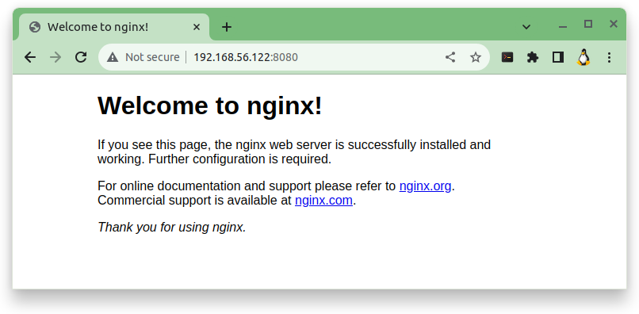

# Primer contenidor amb Docker (**```c01-nginx```**)

En aquesta activitat crearem un contenidor amb **```nginx```**.

> ### Què és nginx?
>
> **```nginx```** (pronunciat **```engine-x```**) és un ***servidor intermediari invers*** (**```reverse proxy server```**) de ***codi obert*** (**```open source```**) per als protocols **```HTTP```**, **```HTTPS```**, **```SMTP```**, **```POP3```** i **```IMAP```**, així com un servidor per ***balancejar la càrrega*** (**```load balancer```**), ***memòria cau HTTP*** (**```HTTP cache```**) i un ***servidor web*** (l'origen d'aquest servidor).
> 
>El **projecte ```nginx```** va començar amb un fort enfocament en l'alta concurrència, alt rendiment i baix ús de memòria.

<hr>
<br>

## **Pas 1**: Creació de l'estructura de nostre primer projecte

* **Comandes a executar**:

```
sudo mkdir ~/c01-nginx
cd ~/c01-nginx
```

* **Sortida**:

```
profe@docker-sxm:~$ sudo mkdir ~/c01-nginx
profe@docker-sxm:~$ cd ~/c01-nginx
profe@docker-sxm:~/c01-nginx$ _ 
```

<hr>

## **Pas 2**: Obtenció de la imatge del servidor web **```nginx```**.

### **Pas 2.1**: Primer cal comprovar <u>*si tenim descarregada localment*</u> la imatge de **```docker```** d'**```nginx```**.

* **Comanda a executar**:

```
sudo docker image list
```

* **Sortida**:

```
profe@docker-sxm:~/c01-nginx$ sudo docker image list
REPOSITORY    TAG       IMAGE ID       CREATED        SIZE
....
nginx         latest    a6bd71f48f68   12 days ago    187MB
....
profe@docker-sxm:~/c01-nginx$ 
```

> [!TIP]
>
> ## Comanda: **```docker image COMANDES```**
>
> ### Descripció:
> 
> Per gestionar de les imatges de **```docker```**
> 
> ### Ús:
> 
> ```
> docker image COMANDES
> ```
> ### [Més informació a **```docker image```**](teo-docker-00-opcions-de-les-comandes-docker.md#comanda-1-docker-image-comandes)
><hr>


### Explicació de les opcions (**```[OPTIONS]```**) fetes servir amb la comanda **```docker image list```**: 

* **Comanda a executar**:

```
sudo docker image list
```

La comanda **```ls```**, llista les imatges que tenim al nostre servidor.

* **Sortida**:

```
profe@docker-sxm:~/c02-wp$ sudo docker image list 
REPOSITORY     TAG       IMAGE ID       CREATED        SIZE
...
nginx          latest    a6bd71f48f68   2 weeks ago    187MB
...
profe@docker-sxm:~/c02-wp$
```

Si la imatge **```nginx:latest```** apareix a la llista de les imatges descarregades, llavors ja tenim la tenim descarregada al nostre servidor.
I ja podem passar al següent pas 

> [!WARNING]
> Però, si la imatge **```nginx:latest```** no ens apareix a l'hora de llistar les imatges, llavors cal descarregar-la.
>
> #### El **pas 2.2** **NOMÉS CAL FER-LO** si la imatge **```nginx:latest```** no ens apareix a l'hora de llistar les imatges
> <hr>


### **Pas 2.2**: Descarregar la imatge **```nginx:latest```** del lloc web de [**```hub.docker.com```**](https://hub.docker.com/).

> [!TIP]
>
> ## Comanda **```docker image pull```**
> 
> ### Descripció:
> 
> Descarrega una imatge d'un registre
> 
> ### Ús:
> 
> ```
> docker image pull [OPTIONS] NAME[:TAG|@DIGEST]
> ```
>
> ### [Més informació a **```docker image pull```**](teo-docker-00-opcions-de-les-comandes-docker.md#comanda-2-docker-image-pull)
><hr>

* **Comanda a executar**:

```
sudo docker image pull nginx
```

* **Sortida**:

```
profe@docker-sxm:~/c01-nginx$ sudo docker image pull nginx
Using default tag: latest
latest: Pulling from library/nginx
1f7ce2fa46ab: Pull complete 
9b16c94bb686: Pull complete 
9a59d19f9c5b: Pull complete 
9ea27b074f71: Pull complete 
c6edf33e2524: Pull complete 
84b1ff10387b: Pull complete 
517357831967: Pull complete 
Digest: sha256:10d1f5b58f74683ad34eb29287e07dab1e90f10af243f151bb50aa5dbb4d62ee
Status: Downloaded newer image for nginx:latest
docker.io/library/nginx:latest
profe@docker-sxm:~/c01-nginx$_
```

Ara si que la imatge **```nginx:latest```** ha d'apareixer a la llista de les imatges descarregades. Per comprovar-ho, tornem a executar la següent comanda:

* **Comanda a executar**:

```
sudo docker image list
```

* **Sortida**:

```
profe@docker-sxm:~/c02-wp$ sudo docker image list 
REPOSITORY     TAG       IMAGE ID       CREATED        SIZE
...
nginx          latest    a6bd71f48f68   2 weeks ago    187MB
...
profe@docker-sxm:~/c02-wp$
```

<hr>

## **Pas 3**: Creació i posada en marxa del contenidor amb el servidor web **```nginx```**.

* **Comandes a executar**:

```
cd ~/c01-nginx
sudo docker container run --name c01-nginx -p 8080:80 -d nginx
```
> [!TIP] 
>
> ## Comanda **```docker container run```**
> 
> ### Descripció:
> 
> Crea i executa un contenidor nou a partir d'una imatge
> 
> ### Ús:
> 
> ```
> docker container run [OPTIONS] IMAGE [COMMAND] [ARG...]
> ```
>
> ### [Més informació a **```docker container run```**](teo-docker-00-opcions-de-les-comandes-docker.md#comanda-3-docker-container-run)
><hr>

### Explicació de les opcions (**```[OPTIONS]```**) fetes servir amb la comanda **```docker container run```**: 

A continuació explicarem un a un tots els paràmetres de la comanda:

* **Comanda executada**:

> ## ```sudo docker container run --name c01-nginx -p 8080:80 -d nginx```

> ## **```--name c01-nginx```**

El paràmetre **```--name <nom del contenidor>```**: Assigna un nom al contenidor

> ## **```-p, --publish list```**

Publica els ports d'un contenidor a l'amfitrió

> ## **```-d, --detach```**

Executa el contenidor en **segon pla** i mostra per pantalla  l'identificador del contenidor.

> ## **```nginx => [IMAGE]```**
 
Indica la imatge de docker que es farà servir per crear el contenidor.
En aquest cas es tracta d'una imatge oficial de **```nginx```**. Si no porta cap etiqueta (**```tag```**) a continuació de la imatge, indica que és la darrera, la més actual (**```latest```**), de les imatges del proveïdor. 

* **Sortida**:

```
profe@docker-sxm:~$ sudo docker container ls
CONTAINER ID  IMAGE  COMMAND            CREATED       STATUS        PORTS                                   NAMES
0e7436fc847e  nginx  "/docker-entr..."  1 minut ago   1 minut ago   0.0.0.0:8080->80/tcp, :::8080->80/tcp   c01-nginx
profe@docker-sxm:~$ _
```

**Pas 3**: Comprovació del correcte funcionament del contenidor amb el servidor web **```nginx```**.

Per poder comprovar si funciona el contenidor amb el servidor web **```nginx```**, abans cal esbrinar quina és l'adreça IP que té en nostre servidor virtual.

* **Comandes a executar**:

```bash
ip a
```

Aquesta comanda ens mostra **TOTA** la informació **TOTES** les **interfície de xarxa** del servidor.

```
profe@docker-sxm:~/c01-nginx$ ip a
1: lo: <LOOPBACK,UP,LOWER_UP> mtu 65536 qdisc noqueue state UNKNOWN group default qlen 1000
    link/loopback 00:00:00:00:00:00 brd 00:00:00:00:00:00
    inet 127.0.0.1/8 scope host lo
       valid_lft forever preferred_lft forever
    inet6 ::1/128 scope host 
       valid_lft forever preferred_lft forever
2: enp0s3: <BROADCAST,MULTICAST,UP,LOWER_UP> mtu 1500 qdisc fq_codel state UP group default qlen 1000
    link/ether 08:00:27:67:51:5c brd ff:ff:ff:ff:ff:ff
    inet 10.0.2.15/24 metric 100 brd 10.0.2.255 scope global dynamic enp0s3
       valid_lft 65087sec preferred_lft 65087sec
    inet6 fe80::a00:27ff:fe67:515c/64 scope link 
       valid_lft forever preferred_lft forever
3: enp0s8: <BROADCAST,MULTICAST,UP,LOWER_UP> mtu 1500 qdisc fq_codel state UP group default qlen 1000
    link/ether 08:00:27:d9:b8:85 brd ff:ff:ff:ff:ff:ff
    inet 192.168.56.122/24 metric 100 brd 192.168.56.255 scope global dynamic enp0s8
       valid_lft 597sec preferred_lft 597sec
    inet6 fe80::a00:27ff:fed9:b885/64 scope link 
       valid_lft forever preferred_lft forever
4: docker0: <BROADCAST,MULTICAST,UP,LOWER_UP> mtu 1500 qdisc noqueue state UP group default 
    link/ether 02:42:f6:54:10:34 brd ff:ff:ff:ff:ff:ff
    inet 172.17.0.1/16 brd 172.17.255.255 scope global docker0
       valid_lft forever preferred_lft forever
    inet6 fe80::42:f6ff:fe54:1034/64 scope link 
       valid_lft forever preferred_lft forever
```

Pero a nosaltres, només ens interessa l'informació de l'**interfície de xarxa** que està configurada com **```Host-Only```**, i, si el **Virtual Box** està amb els valor per defecte, aquestes interfícies tenen una **adreça IP** que comença amb **```192.168.56```**.

* **Comanda a executar**:

```bash
ip a | grep 192.168.56
```

* **Sortida**:

```
profe@docker-sxm:~/c01-nginx$ ip a | grep 192.168.56
    inet 192.168.56.122/24 metric 100 brd 192.168.56.255 scope global dynamic enp0s8
profe@docker-sxm:~/c01-nginx$ _
```

L'adreça IP que ens interessa és aquella que comença amb **```192.168.56```**, en aquest cas és **```192.168.56.122```**.

Ara que ja coneixem l'**adreça IP** amb la que podem accedir al nostre servidor a taves de l'**interfície de xarxa** que està configurada com **```Host-Only```**, només cal escriure-la a un navegador web del nostre portàtil seguida per **```:8080```**.

En el nostre cas **```192.168.56.122:8080```**, recordem que el port, és aquell que hem configurat a la comanda per executar el contenidor.



<!-- Allotjament d'algun contingut estàtic senzill -->

<!-- **Pas 2**: Descarrega dels fitxers del web site.

* **Comandes a executar**:

```
cd ~/c01-nginx
sudo wget https://github.com/SMX-2022-2024/02-installacio-docker/raw/main/web-exemple.zip
```

* **Sortida**:

```
profe@docker-sxm:~/c01-nginx$ cd ~/c01-nginx
profe@docker-sxm:~/c01-nginx$ sudo wget https://github.com/SMX-2022-2024/02-installacio-docker/raw/main/web-exemple.zip
--2023-12-02 19:54:05--  https://github.com/SMX-2022-2024/02-installacio-docker/raw/main/web-exemple.zip
Resolving github.com (github.com)... 140.82.121.4
Connecting to github.com (github.com)|140.82.121.4|:443... connected.
HTTP request sent, awaiting response... 302 Found
Location: https://raw.githubusercontent.com/SMX-2022-2024/02-installacio-docker/main/web-exemple.zip [following]
--2023-12-02 19:54:06--  https://raw.githubusercontent.com/SMX-2022-2024/02-installacio-docker/main/web-exemple.zip
Resolving raw.githubusercontent.com (raw.githubusercontent.com)... 185.199.110.133, 185.199.109.133, 185.199.108.133, ...
Connecting to raw.githubusercontent.com (raw.githubusercontent.com)|185.199.110.133|:443... connected.
HTTP request sent, awaiting response... 200 OK
Length: 1547642 (1.5M) [application/zip]
Saving to: ‘web-exemple.zip’

web-exemple.zip                    100%[================================================================>]   1.48M  5.69MB/s    in 0.3s    

2023-12-02 19:54:06 (5.69 MB/s) - ‘web-exemple.zip’ saved [1547642/1547642]

profe@docker-sxm:~/c01-nginx$ 
```

<hr> 

<hr>

**Pas 2**: Descomprimir el fitxer zip descarregat.

* **Comandes a executar**:

```
sudo unzip web-exemple.zip
sudo mv web-exemple html
sudo chmod -R 777 ~/c01-nginx/html
```

* **Sortida**:

```
profe@docker-sxm:~/c01-nginx$ sudo unzip web-exemple.zip
Archive:  web-exemple.zip
   creating: web-exemple/
  inflating: web-exemple/vitae-sed-condimentum.html  
   creating: web-exemple/assets/
...
  inflating: web-exemple/images/pic01.jpg  
  inflating: web-exemple/images/pic02.jpg  
  inflating: web-exemple/images/avatar.jpg  
  inflating: web-exemple/images/pic04.jpg  
  inflating: web-exemple/rutrum-neque-accumsan.html  
  inflating: web-exemple/magna-sed-adipiscing.html  
  inflating: web-exemple/odio-congue-mattis.html

root@docker-sxm:~/c01-nginx# ls -l
total 1516
drwxrwxr-x 4 root root    4096 Dec  2 18:34 web-exemple
-rw-r--r-- 1 root root 1547642 Dec  2 19:40 web-exemple.zip

root@docker-sxm:~/c01-nginx# mv web-exemple html

root@docker-sxm:~/c01-nginx# ls -l
total 1516
drwxrwxr-x 4 root root    4096 Dec  2 18:34 html
-rw-r--r-- 1 root root 1547642 Dec  2 19:40 web-exemple.zip

root@docker-sxm:~/c01-nginx# ls -ld html
drwxrwxr-x 4 root root 4096 Dec  2 18:34 html

root@docker-sxm:~/c01-nginx# chmod -R 777 ~/c01-nginx/html

root@docker-sxm:~/c01-nginx# ls -ld html
drwxrwxrwx 4 root root 4096 Dec  2 18:34 html
```

<hr>

**Pas 4**: Comprovació de l'estructura de fitxers

* **Comandes a executar**:

```
cd ~/c01-nginx
tree -L 2
```

* **Sortida**:

```
profe@docker-sxm:~/c01-nginx$ cd ~/c01-nginx
profe@docker-sxm:~/c01-nginx$ tree -L 2
.
├── html
│   ├── assets
│   ├── images
│   ├── index.html
│   ├── magna-sed-adipiscing.html
│   ├── odio-congue-mattis.html
│   ├── rutrum-neque-accumsan.html
│   ├── unic.html
│   └── vitae-sed-condimentum.html
└── web-exemple.zip

3 directories, 7 files
profe@docker-sxm:~/c01-nginx$
```

<hr>

-->