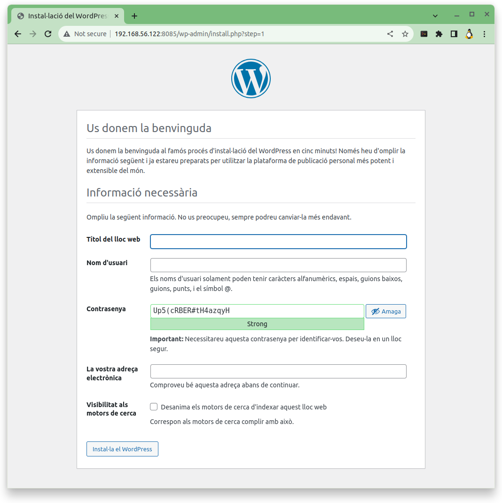
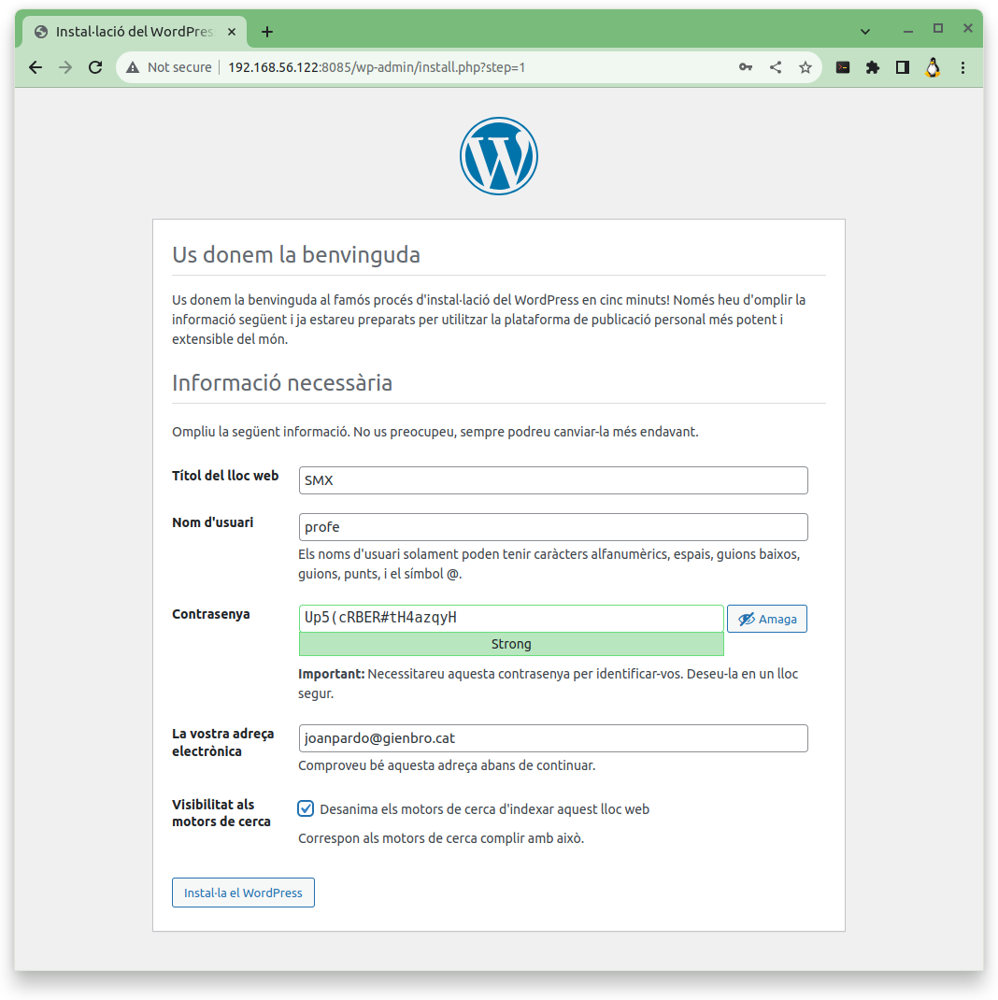
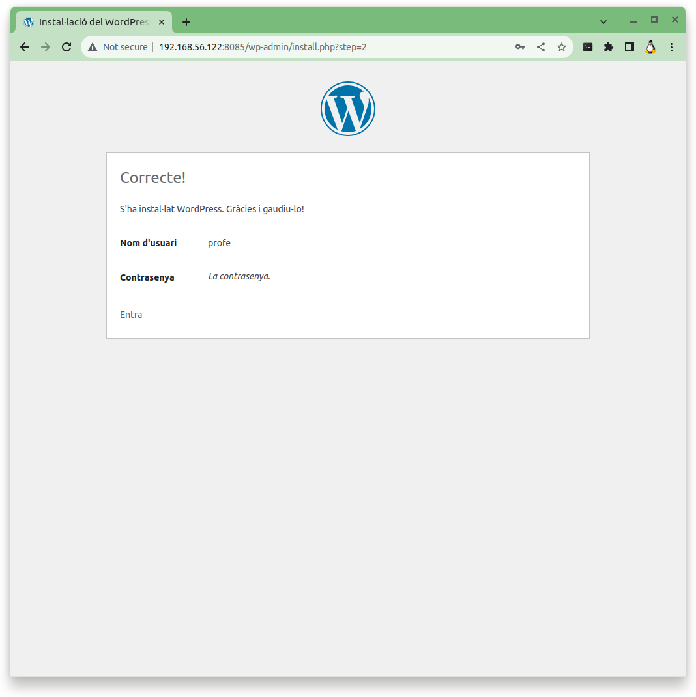

# Creació d'un contenidor de wordpress amb Docker

En aquesta activitat crearem un contenidor amb **```wordpress```**.


<hr>
<br>

## **Pas 1**: Creació de l'estructura de nostre projecte

* **Comandes a executar**:

```
sudo mkdir ~/c02-wordpress
cd ~/c02-wordpress
```

* **Sortida**:

```
profe@docker-sxm:~$ sudo mkdir ~/c02-wordpress
profe@docker-sxm:~$ cd ~/c02-wordpress
profe@docker-sxm:~/c02-wordpress$ _ 
```

<hr>


## **Pas 2**: Descarrega de les imatges que calen per instal·lar el **```wordpress```**

### **Pas 2.1**: Descarrega de la imatge **```wordpress```**

* **Comandes a executar**:

```
sudo docker pull wordpress
```

* **Sortida**:

```
profe@docker-sxm:~/c02-wordpress$ sudo docker pull wordpress
Using default tag: latest
latest: Pulling from library/wordpress
b7f91549542c: Pull complete 
0754b57b9b7d: Pull complete 
71e5060f3937: Pull complete 
f25a6e74b7f5: Pull complete 
c5d33b602102: Pull complete 
866c9e44fbd4: Pull complete 
dd2572036f7c: Pull complete 
23211a2fa48d: Pull complete 
7477e087c645: Pull complete 
8d8d3d5c12ce: Pull complete 
e2fa9cf394d5: Pull complete 
64ffebf1272a: Pull complete 
0f5602f40cda: Pull complete 
7545d59786a7: Pull complete 
18515620b668: Pull complete 
ecbdfb1e3575: Pull complete 
1d98c275c9e8: Pull complete 
b80d2636bcb3: Pull complete 
89407d02d6f2: Pull complete 
9f2c363c3013: Pull complete 
b0e2f5156049: Pull complete 
Digest: sha256:824689613b4e7b027d0d36f264a53a159d6c7adcf5250539e56efe2940651e19
Status: Downloaded newer image for wordpress:latest
docker.io/library/wordpress:latest
profe@docker-sxm:~/c02-wordpress$ _ 
```

### **Pas 2.2**: Descarrega de la imatge **```mysql:5.7```**

* **Comandes a executar**:

```
sudo docker pull mysql:5.7
```

* **Sortida**:

```
profe@docker-sxm:~/c02-wordpress$ sudo docker pull mysql:5.7
5.7: Pulling from library/mysql
Digest: sha256:f566819f2eee3a60cf5ea6c8b7d1bfc9de62e34268bf62dc34870c4fca8a85d1
Status: Image is up to date for mysql:5.7
docker.io/library/mysql:5.7
profe@docker-sxm:~/c02-wordpress$ _
```

### **Pas 2.3**: Confirmació de que tenim descarregades les dues imatges

* **Comandes a executar**:

```
sudo docker image ls
```

* **Sortida**:

```
profe@docker-sxm:~/c02-wordpress$ sudo docker pull mysql:5.7
5.7: Pulling from library/mysql
Digest: sha256:f566819f2eee3a60cf5ea6c8b7d1bfc9de62e34268bf62dc34870c4fca8a85d1
Status: Image is up to date for mysql:5.7
docker.io/library/mysql:5.7
profe@docker-sxm:~/c02-wordpress$ sudo docker image ls
REPOSITORY    TAG       IMAGE ID       CREATED        SIZE
...
wordpress     latest    bc823df9ead2   12 days ago    668MB
...
mysql         5.7       bdba757bc933   5 weeks ago    501MB
...
profe@docker-sxm:~/c02-wordpress$ _
```

<hr>

## **Pas 3**: Creació i confirmació del contingut del fitxer de configuració **```docker-compose.yml```**


### **Pas 3.2**: Creació del fitxer de configuració **```docker-compose.yml```**
* **Comandes a executar**:

```
sudo vi ~/c02-wordpress/docker-compose.yml
```

I dins del fitxer **```docker-compose.yml```** cal que copieu el següent:

```yml
version: '3.1'

services:

  wordpress:
    image: wordpress
    restart: always
    ports:
      - 8085:80
    environment:
      WORDPRESS_DB_HOST: db
      WORDPRESS_DB_USER: profe
      WORDPRESS_DB_PASSWORD: profe
      WORDPRESS_DB_NAME: profe
    volumes:
      - wordpress:/var/www/html

  db:
    image: mysql:5.7
    restart: always
    environment:
      MYSQL_DATABASE: profe
      MYSQL_USER: profe
      MYSQL_PASSWORD: profe
      MYSQL_RANDOM_ROOT_PASSWORD: '1'
    volumes:
      - db:/var/lib/mysql

volumes:
  wordpress:
  db:
```

### **Pas 3.2**: Confirmació del contingut del fitxer de configuració **```docker-compose.yml```**

* **Comandes a executar**:

```
sudo cat ~/c02-wordpress/docker-compose.yml
```

* **Sortida**:

```
profe@docker-sxm:~/c02-wordpress$ cat ~/c02-wordpress/docker-compose.yml
version: '3.1'

services:

  wordpress:
    image: wordpress
    restart: always
    ports:
      - 8085:80
    environment:
      WORDPRESS_DB_HOST: db
      WORDPRESS_DB_USER: profe
      WORDPRESS_DB_PASSWORD: profe
      WORDPRESS_DB_NAME: profe
    volumes:
      - wordpress:/var/www/html

  db:
    image: mysql:5.7
    restart: always
    environment:
      MYSQL_DATABASE: profe
      MYSQL_USER: profe
      MYSQL_PASSWORD: profe
      MYSQL_RANDOM_ROOT_PASSWORD: '1'
    volumes:
      - db:/var/lib/mysql

volumes:
  wordpress:
  db:
profe@docker-sxm:~/c02-wordpress$ _
```


## **Pas 4**: Creació del contenidor amb **```wordpress```** fent servir **```docker compose```**

* **Comandes a executar**:

```
cd ~/c02-wordpress
sudo docker compose up -d
```

* **Sortida**:

```
profe@docker-sxm:~/c02-wordpress$ cd ~/c02-wordpress
sudo docker compose up -d
[+] Running 3/3
 ✔ Network c02-wordpress_default        Created                                                       0.0s 
 ✔ Container c02-wordpress-db-1         Started                                                       0.0s 
 ✔ Container c02-wordpress-wordpress-1  Started                                                       0.0s 
profe@docker-sxm:~/c02-wordpress$ _
```

## **Pas 5**: Confirmació del que contenidor amb **```wordpress```** està funcionant.

* **Comandes a executar**:

```
sudo docker container ls
```

* **Sortida**:

```
profe@docker-sxm:~/c02-wordpress$ sudo docker container ls
CONTAINER ID   IMAGE       COMMAND                  CREATED          STATUS          PORTS                                   NAMES
e7ba3cb82aa2   wordpress   "docker-entrypoint.s…"   23 seconds ago   Up 23 seconds   0.0.0.0:8085->80/tcp, :::8085->80/tcp   c02-wordpress-wordpress-1
340812b43f71   mysql:5.7   "docker-entrypoint.s…"   23 seconds ago   Up 23 seconds   3306/tcp, 33060/tcp                     c02-wordpress-db-1
profe@docker-sxm:~/c02-wordpress$ _
```

## **Pas 6**: Primer accés al contenidor amb **```wordpress```**

Per poder comprovar si funciona el contenidor amb el servidor web **```wordpress```**, abans cal esbrinar quina és l'adreça IP que té en nostre servidor virtual.

* **Comandes a executar**:

```bash
ip a
```

Aquesta comanda ens mostra **TOTA** la informació **TOTES** les **interfície de xarxa** del servidor.

```
profe@docker-sxm:~/c01-contenidor-nginx$ ip a
1: lo: <LOOPBACK,UP,LOWER_UP> mtu 65536 qdisc noqueue state UNKNOWN group default qlen 1000
    link/loopback 00:00:00:00:00:00 brd 00:00:00:00:00:00
    inet 127.0.0.1/8 scope host lo
       valid_lft forever preferred_lft forever
    inet6 ::1/128 scope host 
       valid_lft forever preferred_lft forever
2: enp0s3: <BROADCAST,MULTICAST,UP,LOWER_UP> mtu 1500 qdisc fq_codel state UP group default qlen 1000
    link/ether 08:00:27:67:51:5c brd ff:ff:ff:ff:ff:ff
    inet 10.0.2.15/24 metric 100 brd 10.0.2.255 scope global dynamic enp0s3
       valid_lft 65087sec preferred_lft 65087sec
    inet6 fe80::a00:27ff:fe67:515c/64 scope link 
       valid_lft forever preferred_lft forever
3: enp0s8: <BROADCAST,MULTICAST,UP,LOWER_UP> mtu 1500 qdisc fq_codel state UP group default qlen 1000
    link/ether 08:00:27:d9:b8:85 brd ff:ff:ff:ff:ff:ff
    inet 192.168.56.122/24 metric 100 brd 192.168.56.255 scope global dynamic enp0s8
       valid_lft 597sec preferred_lft 597sec
    inet6 fe80::a00:27ff:fed9:b885/64 scope link 
       valid_lft forever preferred_lft forever
4: docker0: <BROADCAST,MULTICAST,UP,LOWER_UP> mtu 1500 qdisc noqueue state UP group default 
    link/ether 02:42:f6:54:10:34 brd ff:ff:ff:ff:ff:ff
    inet 172.17.0.1/16 brd 172.17.255.255 scope global docker0
       valid_lft forever preferred_lft forever
    inet6 fe80::42:f6ff:fe54:1034/64 scope link 
       valid_lft forever preferred_lft forever
```

Pero a nosaltres, només ens interessa l'informació de l'**interfície de xarxa** que està configurada com **```Host-Only```**, i, si el **Virtual Box** està amb els valor per defecte, aquestes interfícies tenen una **adreça IP** que comença amb **```192.168.56```**.

* **Comanda a executar**:

```bash
ip a | grep 192.168.56
```

* **Sortida**:

```
profe@docker-sxm:~/c01-contenidor-nginx$ ip a | grep 192.168.56
    inet 192.168.56.122/24 metric 100 brd 192.168.56.255 scope global dynamic enp0s8
profe@docker-sxm:~/c01-contenidor-nginx$ _
```

L'adreça IP que ens interessa és aquella que comença amb **```192.168.56```**, en aquest és **```192.168.56.122```**.

Ara que ja coneixem l'**adreça IP** amb la que podem accedir al nostre servidor a taves de l'**interfície de xarxa** que està configurada com **```Host-Only```**, només cal escriure-la a un navegador web del nostre portàtil seguida per **```:8085```**.

En el nostre cas **```192.168.56.122:8085```**





Up5(cRBER#tH4azqyH







