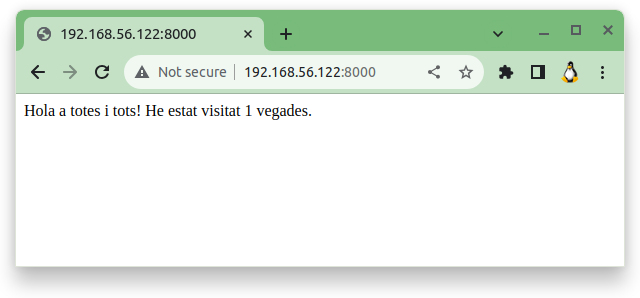

## [Enllaç documentació oficial (docs.docker.com/compose)](https://docs.docker.com/compose/)

# Què és **```docker compose```**

La comanda **```docker compose```** és una eina per definir i executar aplicacions **Docker** de diversos contenidors. **docker compose**, es fa servir un fitxer **```YAML```** per configurar els serveis del **vostre sistema**. Fins al punt, que amb una única comanda, es crea i s'inicien tots els serveis del **vostre sistema**.

**```docker compose```** funciona en tots els ambients: **producció**, **posada en escena** (***staging***), **desenvolupament**, **proves**, així com fluxos de **treball CI** (***workflow CI***). També té ordres per gestionar tot el **cicle de vida** de la vostra aplicació:

* Iniciar, aturar i reconstruir els serveis

* Veure l'estat dels serveis en execució

* Transmetre la sortida del registre dels serveis en execució

* Executar una comanda única en un servei

## Provem **```docker compose```**

Aquest tutorial està dissenyat per introduir els conceptes clau de **```docker compose```** mentre es construeix una aplicació web senzilla de **Python**. L'aplicació utilitza el marc **Flask** i manté un comptador de visites a **Redis**.

**Els conceptes que es mostren aquí són comprensibles encara que no estigueu familiaritzat amb Python.**

### Requisits previs

**1.** Cal tenir **Docker Engine** a la vostra màquina.

Validació que tenim **Docker Engine** instal·lat:

* **Comandes a executar**:

```
sudo docker --version
```

* **Sortida**:

```
profe@docker-sxm:~$ sudo docker --version
Docker version 24.0.7, build afdd53b
profe@docker-sxm:~$ _
```

Si no el teniu instal·lat, el podeu instal·lar seguint l'enllaç [Install Docker Engine on Ubuntu](https://docs.docker.com/engine/install/ubuntu/)

**2.** Cal tenir **Docker Compose** a la vostra màquina.

Validació que tenim **Docker Compose** instal·lat:

* **Comandes a executar**:

```
sudo docker compose version
```

* **Sortida**:

```
profe@docker-sxm:~$ sudo docker compose version
Docker Compose version v2.21.0
profe@docker-sxm:~$ _
```

Si no el teniu instal·lat, el podeu instal·lar seguint l'enllaç [Install Compose standalone](https://docs.docker.com/compose/install/standalone/)


**3.** No cal que instal·leu **Python** o **Redis**, ja que tots dos els proporcionen les **imatges de ```Docker```**.

## **Pas 1**: Definir les dependències de l'aplicació

Creem un directori per al projecte:

* **Comandes a executar**:

```
sudo mkdir ~/teo-compose
cd ~/teo-compose
```

* **Sortida**:

```
profe@docker-sxm:~$ sudo mkdir ~/teo-compose
profe@docker-sxm:~$ cd ~/teo-compose
profe@docker-sxm:~/teo-compose$ _ 
```

## **Pas 2**: Crear un fitxer anomenat **```app.py```** al directori del vostre projecte.

* **Comandes a executar**:

```
sudo vi ~/teo-compose/app.py
```

Contingut del fitxer anomenat **```app.py```**

```py
import time

import redis
from flask import Flask

app = Flask(__name__)
cache = redis.Redis(host='redis', port=6379)

def get_recompte_clics():
    reintents = 5
    while True:
        try:
            return cache.incr('hits')
        except redis.exceptions.ConnectionError as exc:
            if reintents == 0:
                raise exc
            reintents -= 1
            time.sleep(0.5)

@app.route('/')
def hola():
    count = get_recompte_clics()
    return 'Hola a tots! He estat visitat {} vegades.\n'.format(count)
```

En aquest exemple, **```redis```** és el nom d'amfitrió del contenidor **```redis```** a la xarxa de l'aplicació.
Utilitzem el **port predeterminat** per a **```Redis```**, **```6379```**.

> [!TIP]
>
> ### Gestió d'errors
> 
> Tingueu en compte la manera com la funció **```get_recompte_clics```** escriu.
> Aquest bucle de reintent bàsic ens permet intentar la nostra sol·licitud diverses vegades si el servei **```redis```** no està disponible.
> Això és útil a l'inici mentre l'aplicació està en línia, però també fa que l'aplicació sigui més resistent si cal reiniciar el servei **```Redis```** en qualsevol moment durant la vida útil de l'aplicació. En un **clúster**, això també ajuda a gestionar les caigudes de connexió momentània entre els nodes.
> <hr>

## **Pas 3**: Crear un altre fitxer anomenat **```requirements.txt```** al directori del vostre projecte i enganxeu el codi següent:

* **Comandes a executar**:

```
sudo vi ~/teo-compose/requirements.txt
```

Contingut del fitxer anomenat **```requirements.txt```**

```
flask
redis
```

## **Pas 4**: Creació del fitxer **```Dockerfile```**

El **```Dockerfile```** s'utilitza per crear una **imatge ```Docker```**. La imatge conté totes les dependències que requereix l'aplicació **```Python```**, inclòs el mateix **```Python```**.

Al directori del vostre projecte, creeu un fitxer anomenat Dockerfile i enganxeu el codi següent:

* **Comandes a executar**:

```
sudo vi ~/teo-compose/Dockerfile
```

Contingut del fitxer anomenat **```Dockerfile```**

```bash
# syntax=docker/dockerfile:1
FROM python:3.7-alpine
WORKDIR /code
ENV FLASK_APP=app.py
ENV FLASK_RUN_HOST=0.0.0.0
RUN apk add --no-cache gcc musl-dev linux-headers
COPY requirements.txt requirements.txt
RUN pip install -r requirements.txt
EXPOSE 5000
COPY . .
CMD ["flask", "run"]
```

Això diu a **```Docker```** que:

* Crear una imatge a partir de la imatge de **Python 3.7**.

* Establir el directori de treball a **```/code```**.

* Estableix les variables d'entorn utilitzades per l'ordre **```flask```**.

* Instal·la **```gcc```** i altres dependències

* Copia **```requirements.txt```** i instal·la les dependències de **```Python```**.

* Afegeix **metadades** a la imatge per descriure que el contenidor i que ***escolti*** pel **```port 5000```**.

* Copia el contingut del directori actual **```.```** del projecte al directori de treball **```.```** de la imatge.

* Estableix l'ordre per defecte del contenidor a **```flask run```**.

> [!WARNING]
>
> Comproveu que el fitxer **```Dockerfile```** no tingui cap extensió de fitxer com **```.txt```**.
> Alguns editors afegeixen aquesta extensió de fitxer automàticament, el que tot sovint provoca un error quan s'executa l'aplicació.
> <hr>

## **Pas 5**: Definició dels serveis en un fitxer Compose

Crear un fitxer anomenat **```docker-compose.yml```** al directori del projecte amb el següent codi.

* **Comandes a executar**:

```
sudo vi ~/teo-compose/docker-compose.yml
```

Contingut del fitxer anomenat **```docker-compose.yml```**

```yml
services:
  web:
    build: .
    ports:
      - "8000:5000"
  redis:
    image: "redis:alpine"
```

Aquest fitxer **```docker-compose.yml```** defineix dos serveis: **```web```** i **``redis``**.

El servei **```web```** utilitza una imatge creada a partir del directori actual **```Dockerfile```**.

A continuació, uneix el contenidor i la ***màquina host*** al **port exposat, ```8000```**.

Aquest servei d'exemple utilitza el port predeterminat per al servidor web de **```Flask```**, **```5000```**.

El servei **```redis```** utilitza una imatge **```Redis```** pública extreta del registre de **```Docker Hub```**.

## **Pas 6**: creació i execució de l'aplicació amb **```docker compose```**

**6.1** Des del directori del projecte, cal iniciar l'aplicació executant **```docker compose up -d```**.

* **Comandes a executar**:

```
cd ~/teo-compose
sudo docker compose up -d
```

```
profe@docker-sxm:~/teo-compose$ sudo docker compose up -d
[+] Running 9/9
 ✔ redis 8 layers [⣿⣿⣿⣿⣿⣿⣿⣿]      0B/0B      Pulled                                                                                                                5.5s 
   ✔ 661ff4d9561e Pull complete                                                                                                                                    0.8s 
   ✔ 963a98d2b6c2 Pull complete                                                                                                                                    0.5s 
   ✔ dddcc6acb2ed Pull complete                                                                                                                                    0.6s 
   ✔ ff0ac71727e7 Pull complete                                                                                                                                    1.1s 
   ✔ 7959e5ad61f4 Pull complete                                                                                                                                    1.9s 
   ✔ d767cfa2fc09 Pull complete                                                                                                                                    1.3s 
   ✔ 4f4fb700ef54 Pull complete                                                                                                                                    1.8s 
   ✔ 64281ae03186 Pull complete                                                                                                                                    2.0s 
[+] Building 19.2s (13/13) FINISHED                                                                                                                      docker:default
 => [web internal] load build definition from Dockerfile                                                                                                           0.0s
 => => transferring dockerfile: 320B                                                                                                                               0.0s
 => [web internal] load .dockerignore                                                                                                                              0.0s
 => => transferring context: 2B                                                                                                                                    0.0s
 => [web] resolve image config for docker.io/docker/dockerfile:1                                                                                                   2.0s
 => [web] docker-image://docker.io/docker/dockerfile:1@sha256:ac85f380a63b13dfcefa89046420e1781752bab202122f8f50032edf31be0021                                     1.3s
 => => resolve docker.io/docker/dockerfile:1@sha256:ac85f380a63b13dfcefa89046420e1781752bab202122f8f50032edf31be0021                                               0.0s
 => => sha256:ac85f380a63b13dfcefa89046420e1781752bab202122f8f50032edf31be0021 8.40kB / 8.40kB                                                                     0.0s
 => => sha256:657fcc512c7369f4cb3d94ea329150f8daf626bc838b1a1e81f1834c73ecc77e 482B / 482B                                                                         0.0s
 => => sha256:a17ee7fff8f5e97b974f5b48f51647d2cf28d543f2aa6c11aaa0ea431b44bb89 1.27kB / 1.27kB                                                                     0.0s
 => => sha256:9d9c93f4b00be908ab694a4df732570bced3b8a96b7515d70ff93402179ad232 11.80MB / 11.80MB                                                                   1.0s
 => => extracting sha256:9d9c93f4b00be908ab694a4df732570bced3b8a96b7515d70ff93402179ad232                                                                          0.2s
 => [web internal] load metadata for docker.io/library/python:3.7-alpine                                                                                           1.8s
 => [web 1/6] FROM docker.io/library/python:3.7-alpine@sha256:f3d31c8677d03f0b3c724446077f229a6ce9d3ac430f5c08cd7dff00292048c3                                     2.4s
 => => resolve docker.io/library/python:3.7-alpine@sha256:f3d31c8677d03f0b3c724446077f229a6ce9d3ac430f5c08cd7dff00292048c3                                         0.0s
 => => sha256:4819c95424fc4a94767c9329b02238ebcce0bc682384cb671379bc1fb8a12b55 10.94MB / 10.94MB                                                                   1.7s
 => => sha256:f3d31c8677d03f0b3c724446077f229a6ce9d3ac430f5c08cd7dff00292048c3 1.65kB / 1.65kB                                                                     0.0s
 => => sha256:e6da3ee9bb64dd12b98fa609487f112fe1e365522e6e8345309db15c22a80a51 1.37kB / 1.37kB                                                                     0.0s
 => => sha256:1bac8ae77e4af0b868b62a75115616a20e025e0451eeed05d94a4cfc4523e58a 6.87kB / 6.87kB                                                                     0.0s
 => => sha256:96526aa774ef0126ad0fe9e9a95764c5fc37f409ab9e97021e7b4775d82bf6fa 3.40MB / 3.40MB                                                                     0.6s
 => => sha256:9875af95546db78168a6761b7fa205ed1cd0c153cd89356c1512e551c12b2d5c 622.29kB / 622.29kB                                                                 0.6s
 => => sha256:148762f75a1f92cc9857e9c488bf95d5aac61e9905ec47a7408025b2dd5c3b7a 240B / 240B                                                                         0.7s
 => => extracting sha256:96526aa774ef0126ad0fe9e9a95764c5fc37f409ab9e97021e7b4775d82bf6fa                                                                          0.1s
 => => sha256:ea1518237b3753b3fe40ee773d77651704178d9baa72ae5012e13a992cfa6c63 2.85MB / 2.85MB                                                                     1.5s
 => => extracting sha256:9875af95546db78168a6761b7fa205ed1cd0c153cd89356c1512e551c12b2d5c                                                                          0.1s
 => => extracting sha256:4819c95424fc4a94767c9329b02238ebcce0bc682384cb671379bc1fb8a12b55                                                                          0.4s
 => => extracting sha256:148762f75a1f92cc9857e9c488bf95d5aac61e9905ec47a7408025b2dd5c3b7a                                                                          0.0s
 => => extracting sha256:ea1518237b3753b3fe40ee773d77651704178d9baa72ae5012e13a992cfa6c63                                                                          0.2s
 => [web internal] load build context                                                                                                                              0.0s
 => => transferring context: 1.09kB                                                                                                                                0.0s
 => [web 2/6] WORKDIR /code                                                                                                                                        0.1s
 => [web 3/6] RUN apk add --no-cache gcc musl-dev linux-headers                                                                                                    6.8s
 => [web 4/6] COPY requirements.txt requirements.txt                                                                                                               0.1s 
 => [web 5/6] RUN pip install -r requirements.txt                                                                                                                  3.4s 
 => [web 6/6] COPY . .                                                                                                                                             0.1s 
 => [web] exporting to image                                                                                                                                       1.0s 
 => => exporting layers                                                                                                                                            1.0s
 => => writing image sha256:61eb4d7a8164bc681f8e668ceed66d609fd234590035412beecfe3e2e9f67284                                                                       0.0s
 => => naming to docker.io/library/teo-compose-web                                                                                                                 0.0s
[+] Running 3/3
 ✔ Network teo-compose_default    Created                                                                                                                          0.1s 
 ✔ Container teo-compose-web-1    Started                                                                                                                          0.0s 
 ✔ Container teo-compose-redis-1  Started                                                                                                                          0.1s 
profe@docker-sxm:~/teo-compose$ 
```

**```docker compose```** extreu una imatge de **```Redis```**, crea una imatge pel codi i inicia els serveis que s'han definit.

En aquest cas, el codi es copia de manera estàtica a la imatge en temps de creació.

**6.2** Introduïu **```http://<adreça IP del servidor>:8000/```** en un navegador per veure l'aplicació en funcionament.

Hauríeu de veure un missatge al vostre navegador que digui:

```bash
Hola a tots! He estat visitat 1 vegades.
```



**6.3** Actualitza la pàgina.

El nombre de visites hauria d'augmentar.


**6.4** Torneu a la nova finestra de terminal i escriviu **```docker image ls```** per llistar imatges locals.

* **Comandes a executar**:

```
cd ~/teo-compose
sudo docker compose up -d
```

* **Sortida**:

```
profe@docker-sxm:~/teo-compose$ sudo docker image list
REPOSITORY        TAG       IMAGE ID       CREATED          SIZE
...
teo-compose-web   latest    61eb4d7a8164   10 minutes ago   214MB
redis             alpine    d2d4688fcebe   3 days ago       41MB
...
profe@docker-sxm:~/teo-compose$ 
```

Llistar imatges en aquest moment hauria de tornar **```redis```** i **```teo-compose-web```**.

Podeu inspeccionar imatges amb **```docker inspect <tag or id>```**.

* **Comandes a executar**:

```
cd ~/teo-compose
sudo docker inspect teo-compose-web
```

* **Sortida**:

<details>
<summary>Per veure la sortida sencera  ...</summary>

```
profe@docker-sxm:~/teo-compose$ sudo docker inspect teo-compose-web
[
    {
        "Id": "sha256:61eb4d7a8164bc681f8e668ceed66d609fd234590035412beecfe3e2e9f67284",
        "RepoTags": [
            "teo-compose-web:latest"
        ],
        "RepoDigests": [],
        "Parent": "",
        "Comment": "buildkit.dockerfile.v0",
        "Created": "2023-12-11T09:17:29.69552791Z",
        "Container": "",
        "ContainerConfig": {
            "Hostname": "",
            "Domainname": "",
            "User": "",
            "AttachStdin": false,
            "AttachStdout": false,
            "AttachStderr": false,
            "Tty": false,
            "OpenStdin": false,
            "StdinOnce": false,
            "Env": null,
            "Cmd": null,
            "Image": "",
            "Volumes": null,
            "WorkingDir": "",
            "Entrypoint": null,
            "OnBuild": null,
            "Labels": null
        },
        "DockerVersion": "",
        "Author": "",
        "Config": {
            "Hostname": "",
            "Domainname": "",
            "User": "",
            "AttachStdin": false,
            "AttachStdout": false,
            "AttachStderr": false,
            "ExposedPorts": {
                "5000/tcp": {}
            },
            "Tty": false,
            "OpenStdin": false,
            "StdinOnce": false,
            "Env": [
                "PATH=/usr/local/bin:/usr/local/sbin:/usr/local/bin:/usr/sbin:/usr/bin:/sbin:/bin",
                "LANG=C.UTF-8",
                "GPG_KEY=0D96DF4D4110E5C43FBFB17F2D347EA6AA65421D",
                "PYTHON_VERSION=3.7.17",
                "PYTHON_PIP_VERSION=23.0.1",
                "PYTHON_SETUPTOOLS_VERSION=57.5.0",
                "PYTHON_GET_PIP_URL=https://github.com/pypa/get-pip/raw/9af82b715db434abb94a0a6f3569f43e72157346/public/get-pip.py",
                "PYTHON_GET_PIP_SHA256=45a2bb8bf2bb5eff16fdd00faef6f29731831c7c59bd9fc2bf1f3bed511ff1fe",
                "FLASK_APP=app.py",
                "FLASK_RUN_HOST=0.0.0.0"
            ],
            "Cmd": [
                "flask",
                "run"
            ],
            "ArgsEscaped": true,
            "Image": "",
            "Volumes": null,
            "WorkingDir": "/code",
            "Entrypoint": null,
            "OnBuild": null,
            "Labels": {
                "com.docker.compose.project": "teo-compose",
                "com.docker.compose.service": "web",
                "com.docker.compose.version": "2.21.0"
            }
        },
        "Architecture": "amd64",
        "Os": "linux",
        "Size": 213739040,
        "VirtualSize": 213739040,
        "GraphDriver": {
            "Data": {
                "LowerDir": "/var/lib/docker/overlay2/qn1qbd5pbhrfmd4v8vl1soy8r/diff:/var/lib/docker/overlay2/1mylipvpchd6serf9p3gw1v3q/diff:/var/lib/docker/overlay2/pcocae07hq14phijilsubwxov/diff:/var/lib/docker/overlay2/hw4k7w4qogu534klpl42fj7gl/diff:/var/lib/docker/overlay2/c6ef140a3ea9fb08d1ef749b3eb59a56448d61f40679ef9aca907d9fa6110f06/diff:/var/lib/docker/overlay2/04b3c4a1ca51683b4b4415ff4b8037628300a3402735b14c5a3187b3b07ce57e/diff:/var/lib/docker/overlay2/d70a408691a48f6a142acd054b1e56f819bd0301482016e976fddbd150991b9c/diff:/var/lib/docker/overlay2/41fca5839cda74414fb8e1be61bbe37fa8f7b5509721dfc2869cee45579fbc6d/diff:/var/lib/docker/overlay2/d2731f52c56a82a406dcf00dbaaa3d1648186a8a64c50e4d4b5a802c546d0f4a/diff",
                "MergedDir": "/var/lib/docker/overlay2/9ez7vmgvar690go45oy0oox1g/merged",
                "UpperDir": "/var/lib/docker/overlay2/9ez7vmgvar690go45oy0oox1g/diff",
                "WorkDir": "/var/lib/docker/overlay2/9ez7vmgvar690go45oy0oox1g/work"
            },
            "Name": "overlay2"
        },
        "RootFS": {
            "Type": "layers",
            "Layers": [
                "sha256:cc2447e1835a40530975ab80bb1f872fbab0f2a0faecf2ab16fbbb89b3589438",
                "sha256:a1c2f058ec5f25b50d2269b436aa3ba09d5b9c9330a1d93af93bda6f10b541f8",
                "sha256:7f29b11ef9dde60100b31d6432750056282f7af6110bc2c21f7cde8473f28170",
                "sha256:aa3a591fc84ea1958c70ee65913cfbca07947b301cbb40c9df14df376296700a",
                "sha256:ae2ed30791634cdd49b4f0f95fa7236e1dd46790d0038906f2a15040a370cf37",
                "sha256:a8a81f317b4aefaf8c49c6c256792c476081ec9fc51d4f9e12e3c5e4fbc44c18",
                "sha256:afae8ef5247b12e5694e3c24d83d14ad0c98e60f6662841cef45d6e2a7e70d6a",
                "sha256:4a8b1ac152f5f66602726e5c27a72a3aa483419c92f43400583cef7f2b1794a0",
                "sha256:e9ad1eacc683f3e5b3db5571a227d9ca3289f1fdb79a3a138f366109cfdae05a",
                "sha256:9ab16a4c9a4e39ba76bcd5789d3189865d14abc4fc764181ae81c188f20b8690"
            ]
        },
        "Metadata": {
            "LastTagTime": "2023-12-11T09:17:30.717126602Z"
        }
    }
]
profe@docker-sxm:~/teo-compose$ _ 
```
</details>

**6.5** Atureu l'aplicació, ja sigui executant **```docker compose down```** des del directori del vostre projecte al terminal, o prement <kbd>CTRL</kbd>+<kbd>C</kbd> al terminal original on vau iniciar l'aplicació.


* **Comandes a executar**:

```
cd ~/teo-compose
sudo docker compose down
```

* **Sortida**:

```
profe@docker-sxm:~/teo-compose$ sudo docker compose down
[+] Running 3/2
 ✔ Container teo-compose-redis-1  Removed        0.1s 
 ✔ Container teo-compose-web-1    Removed       10.1s 
 ✔ Network teo-compose_default    Removed        0.0s 
profe@docker-sxm:~/teo-compose$ 
```
