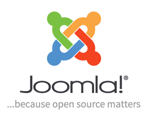

<!-- teo-docker-06-docker-joomla.md -->

# Contenidor de **```Joomla```** amb Docker (**```c04-joomla```**)

## Què és ```Joomla```?

**```Joomla```** és un sistema de gestió de continguts (**```CMS```**) gratuït i de codi obert per publicar contingut web. Es basa en un marc d'aplicació web **```model-vista-controlador```** que es pot utilitzar independentment del **```CMS```**. **```Joomla```** està escrit en **```PHP```**, utilitza tècniques de **programació orientada a objectes** (**```OOP```**) i **patrons de disseny** de programari, emmagatzema dades en una base de dades **```MySQL```**, **```MS SQL```** o **```PostgreSQL```** i inclou funcions com ara la memòria cau de pàgines, fonts RSS, versions imprimibles de pàgines, notícies. flashs, blocs, cerca i suport per a la internacionalització lingüística.

[Joomla (wikipedia.org)](https://en.wikipedia.org/wiki/Joomla)




